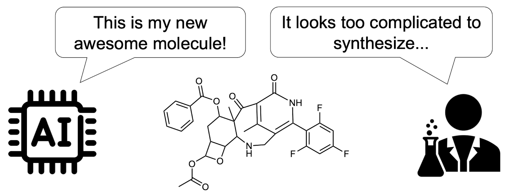

[](https://arxiv.org/abs/2410.04542)
[](https://www.python.org/downloads/)
[](LICENSE)

# RxnFlow: Generative Flows on Synthetic Pathway for Drug Design



Official implementation of **_Generative Flows on Synthetic Pathway for Drug Design_** by Seonghwan Seo, Minsu Kim, Tony Shen, Martin Ester, Jinkyu Park, Sungsoo Ahn, and Woo Youn Kim. [[paper](https://arxiv.org/abs/2410.04542)]

RxnFlow are a synthesis-oriented generative framework that aims to discover diverse drug candidates through GFlowNet objective and a large action space comprising **1M building blocks and 100 reaction templates without computational overhead**.

This project is based on Recursion's GFlowNet Repository; `src/gflownet/` is a clone of [recursionpharma/gflownet@v0.2.0](https://github@v0.2.0.com/recursionpharma/gflownet/tree/v0@v0.2.0.2@v0.2.0.0).

<!-- Since we constantly improve it, current version does not reproduce the same results as the paper. You can access the reproducing codes and scripts from [tag: paper-archive](https://github.com/SeonghwanSeo/RxnFlow/tree/paper-archive). -->

## Setup

### Installation

```bash
# python>=3.12,<3.13
pip install -e . --find-links https://data.pyg.org/whl/torch-2.5.1+cu121.html

# For GPU-accelerated UniDock(Vina) scoring.
conda install unidock==1.1.2
pip install -e '.[unidock]' --find-links https://data.pyg.org/whl/torch-2.5.1+cu121.html

# For Pocket conditional generation
pip install -e '.[pmnet]' --find-links https://data.pyg.org/whl/torch-2.5.1+cu121.html

# Install all dependencies
pip install -e '.[unidock,pmnet,dev]' --find-links https://data.pyg.org/whl/torch-2.5.1+cu121.html
```

### Data Preparation

To construct datas, please follow the process in [data/README.md](data/README.md).

#### Reaction Template

We provide the two reaction template sets:

- **Real**: We provide the 109-size reaction template set [templates/real.txt](templates/real.txt) from Enamine REAL synthesis protocol ([Gao et al.](https://github.com/wenhao-gao/synformer)).
- **HB**: The reaction template used in this paper contains 13 uni-molecular reactions and 58 bi-molecular reactions, which is constructed by [Cretu et al](https://github.com/mirunacrt/synflownet). The template set is available under [templates/hb_edited.txt](template/hb_edited.txt).

#### Building Block Library

We support two building block libraries.

- **ZINCFrag:** For reproducible benchmark study, we propose a new public building block library, which is a subset of ZINC22 fragment set. All fragments are also included in AiZynthFinder's built-in ZINC stock.
- **Enamine:** We support the Enamine building block library, which is available upon request at [https://enamine.net/building-blocks/building-blocks-catalog](https://enamine.net/building-blocks/building-blocks-catalog).

### Download pre-trained model

We provide some pre-trained GFlowNet models which are trained on QED and pocket-conditional proxy (see [./weights/README.md](weights/README.md)).
Each model weight is also automatically downloaded through its name.

## Experiments

<details>
<summary><h3 style="display:inline-block">Custom optimization</h3></summary>

If you want to train RxnFlow with your custom reward function, you can use the base classes from `rxnflow.base`. The reward should be **Non-negative**.

Example codes are provided in [`src/rxnflow/tasks/`](src/rxnflow/tasks) and [`scripts/examples/`](scripts/examples).

- Single-objective optimization

  You can find example codes in [`seh.py`](src/rxnflow/tasks/seh.py) and [`unidock_vina.py`](src/rxnflow/tasks/unidock_vina.py).

  ```python
  import torch
  from rdkit.Chem import Mol, QED
  from gflownet import ObjectProperties
  from rxnflow.base import RxnFlowTrainer, RxnFlowSampler, BaseTask

  class QEDTask(BaseTask):
      def compute_obj_properties(self, mols: list[Chem.Mol]) -> tuple[ObjectProperties, torch.Tensor]:
          is_valid = [filter_fn(mol) for mol in mols] # True for valid objects
          is_valid_t = torch.tensor(is_valid, dtype=torch.bool)
          valid_mols = [mol for mol, valid in zip(mols, is_valid) if valid]
          fr = torch.tensor([QED.qed(mol) for mol in valid_mols], dtype=torch.float)
          fr = fr.reshape(-1, 1) # reward dimension should be [Nvalid, Nprop]
          return ObjectProperties(fr), is_valid_t

  class QEDTrainer(RxnFlowTrainer):  # For online training
      def setup_task(self):
          self.task = QEDTask(self.cfg)

  class QEDSampler(RxnFlowSampler):  # Sampling with trained GFlowNet
      def setup_task(self):
          self.task = QEDTask(self.cfg)
  ```

- Multi-objective optimization (Multiplication-based)

  You can perform multi-objective optimization by designing the reward function as follows:

  $$R(x) = \prod R_{prop}(x)$$

  You can find example codes in [`unidock_vina_moo.py`](src/rxnflow/tasks/unidock_vina_moo.py) and [`multi_pocket.py`](src/rxnflow/tasks/multi_pocket.py).

- Multi-objective optimization (Multi-objective GFlowNets (MOGFN))

  You can find example codes in [`seh_moo.py`](src/rxnflow/tasks/seh_moo.py) and [`unidock_vina_mogfn.py`](src/rxnflow/tasks/unidock_vina_mogfn.py).

  ```python
  import torch
  from rdkit.Chem import Mol as RDMol
  from gflownet import ObjectProperties
  from rxnflow.base import RxnFlowTrainer, RxnFlowSampler, BaseTask

  class MOGFNTask(BaseTask):
      is_moo=True
      def compute_obj_properties(self, mols: list[RDMol]) -> tuple[ObjectProperties, torch.Tensor]:
          is_valid = [filter_fn(mol) for mol in mols]
          is_valid_t = torch.tensor(is_valid, dtype=torch.bool)
          valid_mols = [mol for mol, valid in zip(mols, is_valid) if valid]
          fr1 = torch.tensor([reward1(mol) for mol in valid_mols], dtype=torch.float)
          fr2 = torch.tensor([reward2(mol) for mol in valid_mols], dtype=torch.float)
          fr = torch.stack([fr1, fr2], dim=-1)
          assert fr.shape == (len(valid_mols), self.num_objectives)
          return ObjectProperties(fr), is_valid_t

  class MOOTrainer(RxnFlowTrainer):  # For online training
      def set_default_hps(self, base: Config):
          super().set_default_hps(base)
          base.task.moo.objectives = ["obj1", "obj2"] # set the objective names

      def setup_task(self):
          self.task = MOGFNTask(self.cfg)

  class MOOSampler(RxnFlowSampler):  # Sampling with trained GFlowNet
      def setup_task(self):
          self.task = MOGFNTask(self.cfg)
  ```

- Finetuning a pre-trained model (non-MOGFN)

  We observed that pre-training can be helpful for initial model training.
  It can be done by setting `config.pretrained_model_path`:

  ```python
  from rxnflow.utils.download import download_pretrained_weight

  # download GFN (temperature=U(0,64)) trained on qed reward
  qed_model_path = download_pretrained_weight('qed-unif-0-64')
  config.pretrained_model_path = qed_model_path
  ```

</details>

<details>
<summary><h3 style="display:inline-block"> Docking optimization with GPU-accelerated UniDock</h3></summary>

#### Single-objective optimization

To train GFlowNet with Vina score using GPU-accelerated [UniDock](https://pubs.acs.org/doi/10.1021/acs.jctc.2c01145), run:

```bash
python scripts/opt_unidock.py -h
python scripts/opt_unidock.py \
  --env_dir <Environment directory> \
  --out_dir <Output directory> \
  -n <Num iterations (64 molecules per iterations; default: 1000)> \
  -p <Protein PDB path> \
  -c <Center X> <Center Y> <Center Z> \
  -l <Reference ligand, required if center is empty. > \
  -s <Size X> <Size Y> <Size Z> \
  --search_mode <Unidock mode; choice=(fast, balance, detail); default: fast> \
  --filter <Drug filter; choice=(lipinski, veber, null); default: lipinski> \
  --subsampling_ratio <Subsample ratio; memory-variance trade-off; default: 0.02> \
  --pretrained_model <Pretrained model path; optional>
```

#### Multi-objective optimization

To perform multi-objective optimization for Vina and QED, we provide two reward designs:

- Multiplication-based Reward:

  $$R(x) = \text{QED}(x) \times \widehat{\text{Vina}}(x)$$

  ```bash
  python scripts/opt_unidock_moo.py -h
  ```

- Multi-objective GFlowNet (MOGFN):

  $$R(x;\alpha) = \alpha \text{QED}(x) + (1-\alpha) \widehat{\text{Vina}}(x)$$

  ```bash
  python scripts/opt_unidock_mogfn.py -h
  ```

#### Example (KRAS G12C mutation)

- Use center coordinates

  ```bash
  python scripts/opt_unidock.py -o ./log/kras --filter veber \
    -p ./data/examples/6oim_protein.pdb -c 1.872 -8.260 -1.361
  ```

- Use center of the reference ligand

  ```bash
  python scripts/opt_unidock_mogfn.py -o ./log/kras_moo \
    -p ./data/examples/6oim_protein.pdb -l ./data/examples/6oim_ligand.pdb
  ```

- Use pretrained model (see [weights/README.md](weights/README.md))

  We provided pretrained model trained on QED for non-MOGFN :

  ```bash
  # fine-tune pretrained model
  python scripts/opt_unidock.py ... --pretrained_model 'qed-unif-0-64'
  python scripts/opt_unidock_moo.py ... --pretrained_model 'qed-unif-0-64'
  ```

</details>

<details>
<summary><h3 style="display:inline-block"> Pocket-conditional generation (Zero-shot sampling)</h3></summary>

#### Sampling

Sample high-affinity molecules in a zero-shot manner (no training iterations):

```bash
python scripts/sampling_zeroshot.py \
  --model_path <Checkpoint path; default: qvina-unif-0-64> \
  --env_dir <Environment directory> \
  -p <Protein PDB path> \
  -c <Center X> <Center Y> <Center Z> \
  -l <Reference ligand, required if center is empty. > \
  -o <Output path: `smi|csv`> \
  -n <Num samples (default: 100)> \
  --subsampling_ratio <Subsample ratio; memory-variance trade-off; default: 0.1> \
  --cuda
```

**Example (KRAS G12C mutation)**

- `csv`: save molecules with their rewards (GPU is recommended)

  ```bash
  python scripts/sampling_zeroshot.py -o out.csv -p ./data/examples/6oim_protein.pdb -c 1.872 -8.260 -1.361 --cuda
  ```

- `smi`: save molecules only (CPU: 0.06s/mol, GPU: 0.04s/mol)

  ```bash
  python scripts/sampling_zeroshot.py -o out.smi -p ./data/examples/6oim_protein.pdb -l ./data/examples/6oim_ligand.pdb
  ```

#### Training

To train model, pocket database should be constructed. Please refer [data/](./data/).

For reward function, we used proxy model [[github](https://github.com/SeonghwanSeo/PharmacoNet/tree/main/src/pmnet_appl)] to estimate QuickVina docking score.

```bash
python scripts/train_pocket_conditional.py \
  --env_dir <Environment directory> \
  --out_dir <Output directory> \
  --batch_size <Batch size; memory-variance trade-off; default: 64> \
  --subsampling_ratio <Subsample ratio; memory-variance trade-off; default: 0.02>
```

</details>

<details>
<summary><h3 style="display:inline-block">Few shot training from pocket-conditional generation</h3></summary>

We can do few-shot training for a single pocket by fine-tuning the pocket conditional GFlowNet.
Pocket embedding and action embedding are frozen, so we can use higher subsampling ratio.

```bash
python scripts/few_shot_unidock_moo.py \
  --env_dir <Environment directory> \
  --out_dir <Output directory> \
  --pretrained_model <Pretrained model path; default: qvina-unif-0-64> \
  -n <Num iterations (64 molecules per iterations; default: 1000)> \
  -p <Protein PDB path> \
  -c <Center X> <Center Y> <Center Z> \
  -l <Reference ligand, required if center is empty. > \
  -s <Size X> <Size Y> <Size Z> \
  --search_mode <Unidock mode; choice=(fast, balance, detail); default: fast> \
  --subsampling_ratio <Subsample ratio; memory-variance trade-off; default: 0.04>
```

</details>

<details>
<summary><h3 style="display:inline-block">Reproducing experimental results</h3></summary>

The training/sampling scripts are provided in `experiments/`.

**_NOTE_**: Current version do not fully reproduce the paper result. Please switch to [tag: paper-archive](https://github.com/SeonghwanSeo/RxnFlow/tree/paper-archive).

</details>

## Technical Report

TBA; We will provide the technical report including a new benchmark test using our new building block set.

## Citation

If you use our code in your research, we kindly ask that you consider citing our work in papers:

```bibtex
@article{seo2024generative,
  title={Generative Flows on Synthetic Pathway for Drug Design},
  author={Seo, Seonghwan and Kim, Minsu and Shen, Tony and Ester, Martin and Park, Jinkyoo and Ahn, Sungsoo and Kim, Woo Youn},
  journal={arXiv preprint arXiv:2410.04542},
  year={2024}
}
```

## Related Works

- [GFlowNet](https://arxiv.org/abs/2106.04399) [github: [recursionpharma/gflownet](https://github.com/recursionpharma/gflownet)]
- [TacoGFN](https://arxiv.org/abs/2310.03223) [github: [tsa87/TacoGFN-SBDD](https://github.com/tsa87/TacoGFN-SBDD)]
- [PharmacoNet](https://arxiv.org/abs/2310.00681) [github: [SeonghwanSeo/PharmacoNet](https://github.com/SeonghwanSeo/PharmacoNet)]
